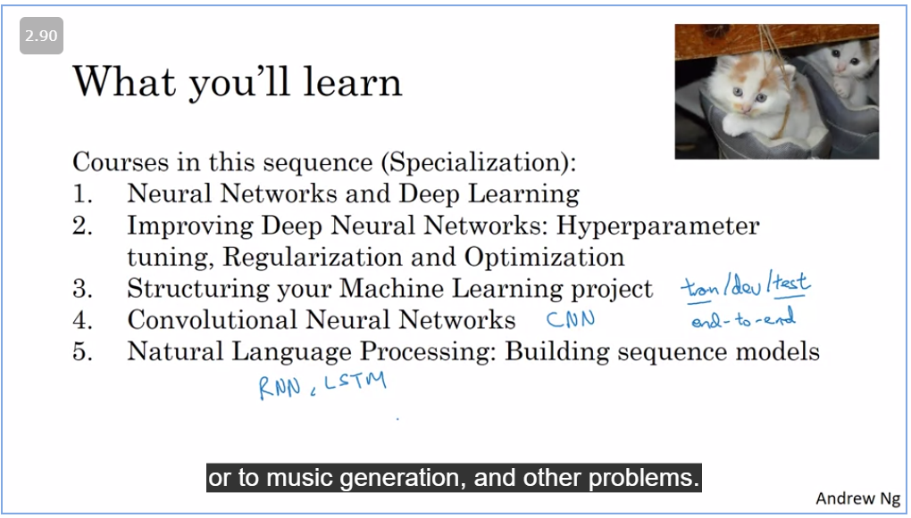

# Welcome to Deep Learning specialisation

[Lecture notes](https://d3c33hcgiwev3.cloudfront.net/0QkmLH9eRj-JJix_XvY_8g_cd513a39d322432394d1b2353c6cc9a1_C1W1.pdf?Expires=1624147200&Signature=QPhvkwbH1UDnfaFx5lirVvVpoVKgoXwGJ~v-mY-iJ-Bq-30HA08MqfUlCVLYwpQpQY~FwXYsqpddtmBcrl4eeRBtjUY16BtdjN6dceji~gz7EZMTGpHXio1KDKQa20UiNdCKEVOVVYIiuHKTjP6~tgc9e2dzabOzVDDo4GuadPA_&Key-Pair-Id=APKAJLTNE6QMUY6HBC5A)

# Introduction to Deep Learning

Relu graph is 0 then for positive number it is linearly proportional.

Introduction to what a neural network looks like.

### Supervised Learning with Neural networks

Gives information on SUpervised learning.

Structured data - Tables
unstructured data - Music, image

### Why is deep learning taking off

Deep nn just progres so well, because of 

1. Data 
2. Computation
3. Algorithm

m denotes number of samples.

### About this course

How we proceed is mentioned here

### Reading frequently asked questions

If you find an error , post it on Discourse.

Not able to do the quiz!

[Geoffery Hinton interview](https://www.coursera.org/learn/neural-networks-deep-learning/lecture/dcm5r/geoffrey-hinton-interview)
