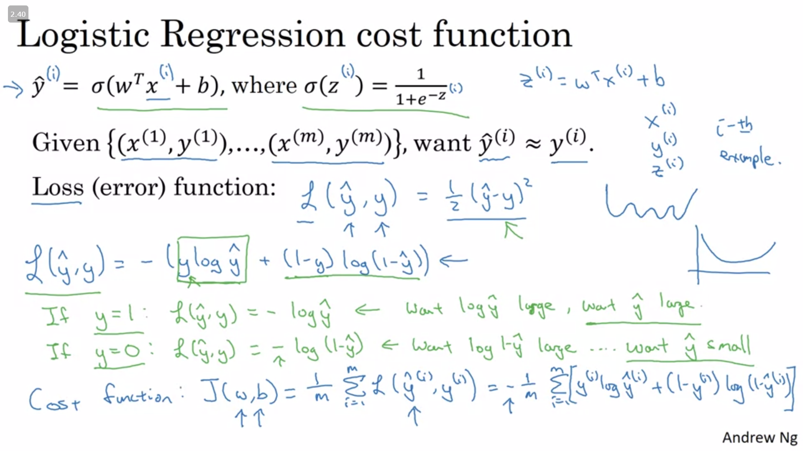
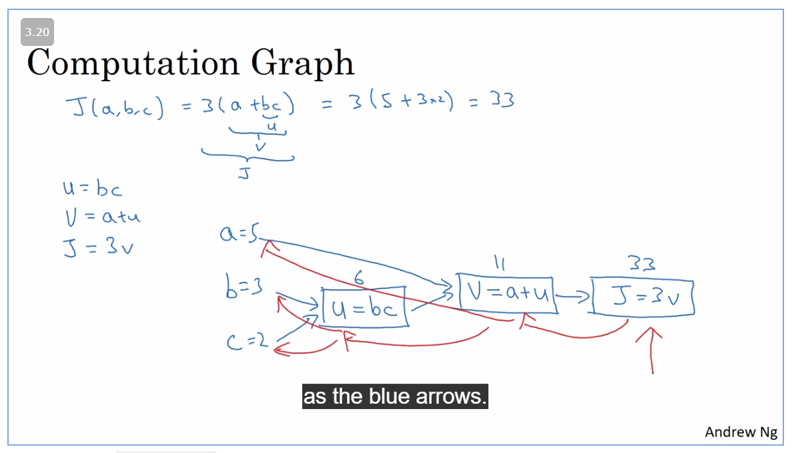

# Logistic Regression as a Neural Network

### Binary Classification

(X, y)

`where x = [array of individual features * total number of samples]`

`y = [target * total number of samples]`

### Logistic Regression

given X we try to find the probability of `y = P(y=1/x)`

it means y should be between and one

linear regression:

`output = Y = w.T * x + b`

logistic regression:
`output = Y = sigmoid(w.T * x + b)`

`sigmoid(z) = 1/(1+e^z)`

for large z , `sigmoid(z) ~ 1`
for small z, `sigmoid(z) ~ 0`

Aim of logistic regression is to find W and b such that there is chance of y becoming a one/zero based on training set.

Alterantely, 

`y = sigmoid(theta * x)`
where `theta = [theta0, theta1, theta2...thetan]`
where `theta0 = b`
and `theta1,theta2...thetan = w`

### Logistic regression cost function

given, `y = 1/1+e^-(w*x + b)`

we need y pred to match the actual targets,

`loss = 1/2 * (ypred - y)^2`

or `-(ylog(y_pred) + (1-y)log(1-ypred))`

cost function would be `J(w,b) = sum of all losses * 1/m`

### Gradient Descent

Gradient desent means finding the value of w and b such that the cost function is minimum.

`d/d(w,b) (J(w,b)) = d/dw(J(w)) + d/dw(J(b))`

`Repeat {`
`    w = w - alpha * d/dw(J(w))`
`}`

### Intuitive understanding of Calculus

Derivative means that if we nudge value of x by an infinitesimal amount how much would the value of y change. derivative is same for a straight line

### More derivative examples

if f(a) = a^2 => derivative is 2a
if f(a) = a^3 => derivative is 3a
if f(a) = log(a) => derivative is 1/a

### Computational graph

It is about trying to find how much the final value is affected if you change the intermediate values.

