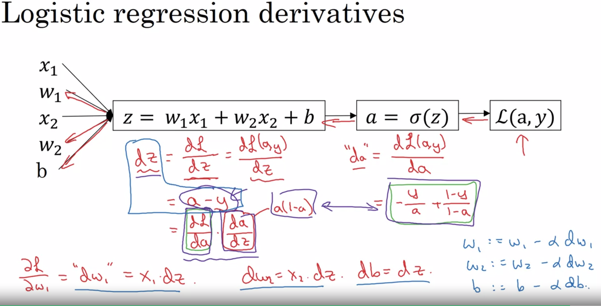
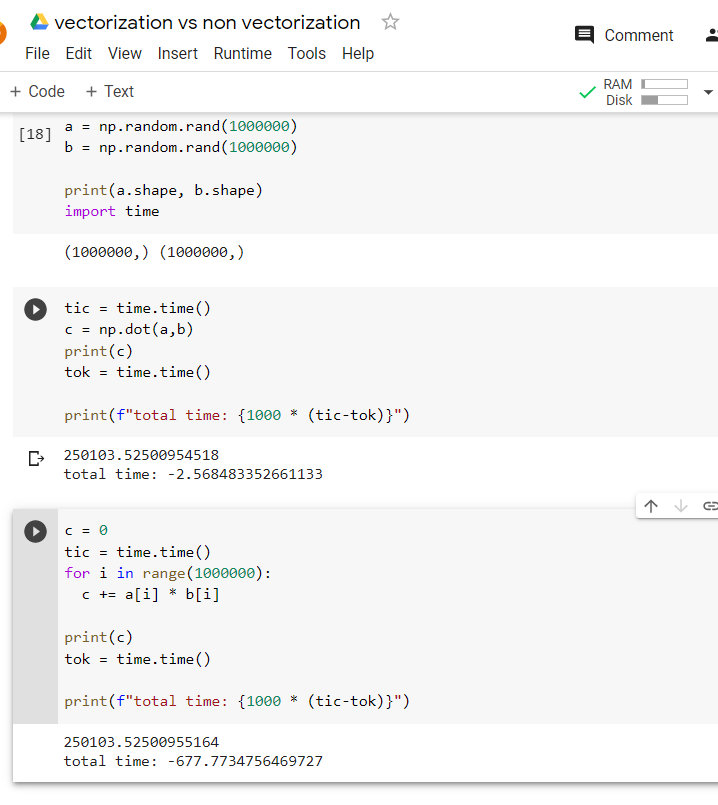
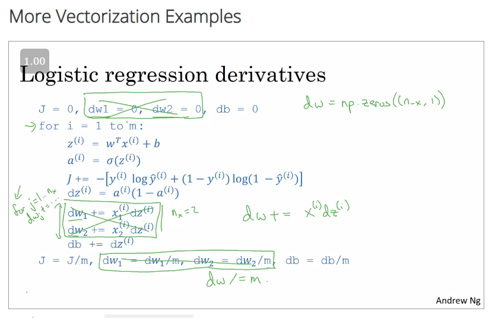

# Logistic Regression as a Neural Network

### Binary Classification

(X, y)

`where x = [array of individual features * total number of samples]`

`y = [target * total number of samples]`

### Logistic Regression

given X we try to find the probability of `y = P(y=1/x)`

it means y should be between and one

linear regression:

`output = Y = w.T * x + b`

logistic regression:
`output = Y = sigmoid(w.T * x + b)`

`sigmoid(z) = 1/(1+e^z)`

for large z , `sigmoid(z) ~ 1`
for small z, `sigmoid(z) ~ 0`

Aim of logistic regression is to find W and b such that there is chance of y becoming a one/zero based on training set.

Alterantely, 

`y = sigmoid(theta * x)`
where `theta = [theta0, theta1, theta2...thetan]`
where `theta0 = b`
and `theta1,theta2...thetan = w`

### Logistic regression cost function

given, `y = 1/1+e^-(w*x + b)`

we need y pred to match the actual targets,

`loss = 1/2 * (ypred - y)^2`

or 

`loss = -(ylog(y_pred) + (1-y)log(1-ypred))`


cost function would be `J(w,b) = sum of all losses * 1/m`

### Gradient Descent

Gradient desent means finding the value of w and b such that the cost function is minimum.

`d/d(w,b) (J(w,b)) = d/dw(J(w)) + d/dw(J(b))`

`Repeat {`
`    w = w - alpha * d/dw(J(w))`
`}`

### Intuitive understanding of Calculus

Derivative means that if we nudge value of x by an infinitesimal amount how much would the value of y change. derivative is same for a straight line

### More derivative examples

if f(a) = a^2 => derivative is 2a
if f(a) = a^3 => derivative is 3a
if f(a) = log(a) => derivative is 1/a

### Computational graph


It is about trying to find how much the final value is affected if you change the intermediate values.

### Gradient descent for logistic regression

```python
z = w.T * x + b
y_pred = a = sigmoid(z)

L(a,y) = -(ylog(a)+ (1-y)log(1-a))
```
It is translated,

if given two features x1 and x2, with w1 and w2 respectively as weights and b as bias then,
```python
z = w1.T * x1 + w2.T * x2 + b

y_pred = sigmoid(z)= 1/ 1+ (e ^ z) = 1/ (1 + (e ^ (w1.T * x1 + w2.T * x2 + b)))
```
then the cost function would be ,

``` python
L(a,y) = -(y * log(1/ (1 + (e ^ (w1.T * x1 + w2.T * x2 + b))))) + (1-y)log(1 -(1/ (1 + (e ^ (w1.T * x1 + w2.T * x2 + b)))) )
```



### Gradient Descent on m examples

Logistic regression cost formula was really the mean of cost over all examples

so the derivative of cost function w.r.t weights is also the mean of derviative of individual cost functions.

```python

J = 1/m * sum(L(a,y)), where L=-(ylog(a) - (1-y)*log(1-a)) a = sigmoid(z) and z = w.T + b

dJ/dw = 1/m * sum ( d(L(a,y))/dw)

# now
for i in range(m:)
    dz = a- y
    dw1 = x1 * dz
    # and weight would be updated as
    w1 = w1 - learning_rate * dw1

```

## Python and vectorization

### Vectorisation

In a non vectorisationworld we would have been using loops

instead we can directly use vector array to perform operations.

z = np.dot(w,x).tb

Massive time difference:


### More vectorisation examples

1. Example 1

```python

u = A*v

ui = Sum (Aij * Vj)

u[i] = A[i][j] + v[j]

# Vectorisation 

u = np.dot(A, v)
```

2. Example 2

```python
v = [v1..vn]
u = [e^v1 .. e^vn]

u = np.zeros((n,1))
for i in range(n):
    u[i] = math.exp(v[i])

# Vectorisation 

import numpy as np

u = np.exp(v)

# there are other functions

u = np.exp(v)
np.log(v)
np.abs(v)
np.maximum(v, o)
v**2
```


### Clarification of "dz"

dz = a(1-a) == a - y

// note to self go back to the first thing and then try implement the code from week one.


